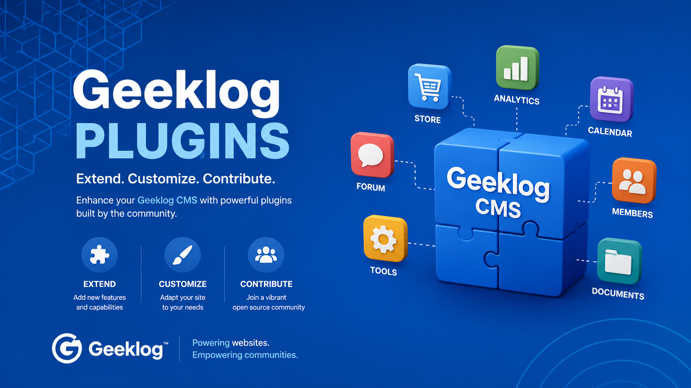

# Geeklog Plugins

Welcome to **Geeklog Plugins**, a community-driven GitHub organization dedicated to preserving, maintaining, modernizing, and developing plugins for the [Geeklog CMS](https://www.geeklog.net/).

Geeklog is an open-source content management system designed for building secure, flexible, and extensible websites. Plugins extend the core CMS with additional features ranging from analytics and SEO to media management, forums, security tools, and administrative utilities.

This organization brings many of these extensions together in one place.

## Our Goals

The Geeklog Plugins organization aims to:

* Preserve useful Geeklog plugins and their source code.
* Modernize existing plugins for current Geeklog releases.
* Improve compatibility with modern PHP versions.
* Develop new extensions for current website requirements.
* Simplify plugin installation and configuration.
* Improve documentation for administrators and developers.
* Provide a central place for community contributions.
* Help keep the Geeklog ecosystem active and extensible.

Some repositories contain actively maintained projects, while others preserve older community plugins that may require modernization.

Always check the README, releases, requirements, and open issues of an individual repository before installing a plugin on a production website.

## Modern Geeklog Plugins

New and modernized plugins increasingly target **Geeklog 2.2.2 and later** and use Geeklog's native APIs whenever possible.

Modernization work may include:

* PHP 8.x compatibility
* Geeklog Configuration API integration
* Modern plugin installation and upgrade routines
* Removal of obsolete installation mechanisms
* Improved security and input validation
* Cleaner Geeklog API integration
* Better administration interfaces
* Updated third-party API integrations
* Improved documentation

The objective is not simply to keep old code running, but to make useful Geeklog extensions easier to maintain and use.

## Featured Projects

### [Analytics](https://github.com/Geeklog-Plugins/analytics)

Google Analytics 4 integration for Geeklog, including frontend GA4 tracking and an administration dashboard using the Google Analytics Data API.

### [IndexNow](https://github.com/Geeklog-Plugins/IndexNow)

Integrates the IndexNow protocol with Geeklog so updated, created, and deleted content can be submitted quickly to compatible search engines.

### [Videos](https://github.com/Geeklog-Plugins/videos)

Video-related functionality for Geeklog and part of the current effort to provide modern extensions for the CMS.

### [Maintenance](https://github.com/Geeklog-Plugins/maintenance)

Tools related to Geeklog website maintenance and administration.

## More Plugins

The organization also preserves and develops plugins covering many areas of the Geeklog ecosystem.

Examples include:

* [Amazon Links](https://github.com/Geeklog-Plugins/amazonlinks)
* [Autotags](https://github.com/Geeklog-Plugins/autotags)
* [Captcha](https://github.com/Geeklog-Plugins/captcha)
* [Classifieds](https://github.com/Geeklog-Plugins/classifieds)
* [Contact](https://github.com/Geeklog-Plugins/contact)
* [DokuWiki](https://github.com/Geeklog-Plugins/dokuwiki)
* [FAQ](https://github.com/Geeklog-Plugins/faq)
* [Flickr](https://github.com/Geeklog-Plugins/flickr)
* [Forum](https://github.com/Geeklog-Plugins/forum)
* [Hello](https://github.com/Geeklog-Plugins/hello)
* [Maps](https://github.com/Geeklog-Plugins/maps)
* [Media Gallery](https://github.com/Geeklog-Plugins/mediagallery)
* [Menu](https://github.com/Geeklog-Plugins/menu)
* [Monitor](https://github.com/Geeklog-Plugins/monitor)
* [PayPal](https://github.com/Geeklog-Plugins/paypal)
* [Search Rank](https://github.com/Geeklog-Plugins/searchrank)

Browse the [Geeklog-Plugins repositories](https://github.com/orgs/Geeklog-Plugins/repositories) to discover the complete collection.

## Plugin Compatibility

Compatibility varies between repositories.

Some plugins are modern projects designed for recent Geeklog and PHP releases. Others are historical plugins preserved because they may still contain useful functionality or provide a good starting point for future development.

Before using a plugin, check:

1. The supported Geeklog version.
2. The required PHP version.
3. The latest release date.
4. Installation and upgrade instructions.
5. Open issues and known limitations.
6. Whether the plugin is actively maintained.

If a plugin has not yet been updated for a recent Geeklog release, contributions are welcome.

## For Developers

Geeklog provides a plugin architecture that allows extensions to integrate with CMS services such as:

* authentication and permissions
* configuration
* content
* search
* comments
* autotags
* administration
* templates
* events
* installation and upgrades

Developers interested in creating or modernizing Geeklog plugins can also consult the [Memorandum repository](https://github.com/Geeklog-Plugins/memorandum), which collects development and modernization guidance for the Geeklog plugin ecosystem.

## Contributing

Community contributions are welcome.

You can help by:

* Testing plugins with recent Geeklog versions.
* Reporting bugs.
* Improving documentation.
* Testing compatibility with recent PHP versions.
* Fixing deprecated or obsolete code.
* Improving accessibility or administration interfaces.
* Adding translations.
* Suggesting new features.
* Submitting pull requests.
* Helping modernize older plugins.

For a problem affecting a specific plugin, please use the **Issues** section of that plugin's repository.

When reporting a problem, include useful information such as:

* Geeklog version
* PHP version
* Plugin version
* Error message or relevant log entry
* Steps required to reproduce the problem

This makes investigation much easier.

## Testing and Development

Several plugins in this organization may be undergoing modernization or active testing.

Development versions should not automatically be considered production-ready. Check the repository's releases and documentation before deployment.

Testing and feedback from Geeklog administrators and developers are especially valuable as older plugins are updated for the current Geeklog architecture.

## About Geeklog

Geeklog is a PHP-based open-source content management system with a long history of providing structured content management, security features, user management, plugins, themes, and extensibility.

Learn more about Geeklog:

* **Official website:** [geeklog.net](https://www.geeklog.net/)
* **Geeklog source code:** [Geeklog-Core/geeklog](https://github.com/Geeklog-Core/geeklog)
* **Geeklog Plugins:** [Geeklog-Plugins](https://github.com/Geeklog-Plugins)

## Help Keep the Geeklog Ecosystem Moving Forward

Open-source projects remain useful when their communities test, document, maintain, and improve them.

If you use Geeklog, explore the repositories, test the plugins, report problems, suggest improvements, or contribute code.

Every contribution can help make Geeklog easier to use and maintain for the next generation of websites.
